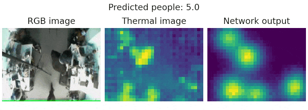

# Thermo presence

<!--  -->
[](https://github.com/PUTvision/thermo-presence/graphs/contributors)
[](https://github.com/PUTvision/thermo-presence/stargazers)
[](https://github.com/PUTvision/thermo-presence/network/members)

## **Detect and count people on infrared images from a low resolution thermovision camera (24x32 pixels).**

> This is the official repo for the paper: [Low-Cost Thermal Camera-Based Counting Occupancy Meter Facilitating Energy Saving in Smart Buildings](https://www.mdpi.com/1996-1073/14/15/4542/htm)

## Overview
<p align="center">
    
</p>

> Using passive infrared sensors is a well-established technique of presence monitoring. While it can significantly reduce energy consumption, more savings can be made when utilising more modern sensor solutions coupled with machine learning algorithms. This paper proposes an improved method of presence monitoring, which can accurately derive the number of people in the area supervised with a low-cost and low-energy thermal imaging sensor. The method utilises U-Net-like convolutional neural network architecture and has a low parameter count, and therefore can be used in embedded scenarios. Instead of providing simple, binary information, it learns to estimate the occupancy density function with the person count and approximate location, allowing the system to become considerably more flexible. The tests show that the method compares favourably to the state of the art solutions, achieving significantly better results.

## Table of contents
* [Dataset](#dataset)
* [Data collection](#data-collection)
* [Data processing](#data-processing)
* [Citation](#citation)

## Dataset
Our dataset is publicly available in the [dataset](./dataset/) directory in the form of HDF files which consist of data arrays (thermal images) and labels (people positions' coordinates). The raw thermal data and illustrative RGB images are available in the [cloud shared folder](https://chmura.put.poznan.pl/s/2NL2IJKuUuKn0yf). Moreover, the [dataset/README.md](./dataset/README.md) includes training, validation and test sequences split and example data loading using Python. The table below shows the summary of training, validation, and test datasets considering the number of people in the frame.

<div align="center">

|            |  0  |  1  |   2  |   3  |   4  |  5  | Total |
|:----------:|:---:|:---:|:----:|:----:|:----:|:---:|:-----:|
|  Training  |  99 | 105 | 2984 | 3217 | 1953 | 114 |  8472 |
| Validation |  0  | 139 |  631 | 1691 |  225 | 139 |  2825 |
|    Test    | 162 |  83 |  211 |  341 | 1235 | 315 |  2347 |

</div>

## Data collection
Software to record the data from camera.  
To be deployed on the RaspberryPi device.  
See [data_collection/README.md](./data_collection/README.md)

## Data processing
Software to process/analyse the data.  
See [data_processing/README.md](./data_processing/README.md)

## Hardware evaluation
Script to evaluate model on Thermo Presence dataset.
Tested on [Raspberry Pi 4B](https://www.raspberrypi.com/products/raspberry-pi-4-model-b/) with [Intel Neural Compute Stick 2](https://ark.intel.com/content/www/us/en/ark/products/140109/intel-neural-compute-stick-2.html) and [Google Coral USB Accelerator](https://coral.ai/products/accelerator/).
See [evaluation/README.md](./evaluation/README.md)

## Citation

```
@Article{en14154542,
    AUTHOR = {Kraft, Marek and Aszkowski, Przemysław and Pieczyński, Dominik and Fularz, Michał},
    TITLE = {Low-Cost Thermal Camera-Based Counting Occupancy Meter Facilitating Energy Saving in Smart Buildings},
    JOURNAL = {Energies},
    VOLUME = {14},
    YEAR = {2021},
    NUMBER = {15},
    ARTICLE-NUMBER = {4542},
    URL = {https://www.mdpi.com/1996-1073/14/15/4542},
    ISSN = {1996-1073},
    DOI = {10.3390/en14154542}
}
```
