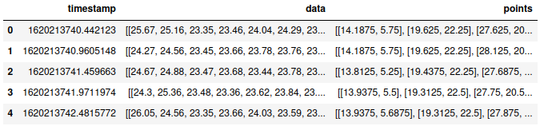
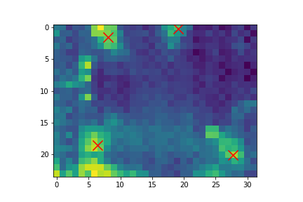

# Thermo Presence Dataset

The Thermo Presence Dataset consists of thermal images with resolution 24x32 px and corresponding annotations in form of X and Y coordinates. Recorded data are in [hdfs](./hdfs) directory. Furthermore, collected frames are divided into sequences which then are split into training, validation, and test sets as follows:

```
training_dirs: [
    "006__11_44_59", "007__11_48_59", "008__11_52_59", 
    "009__11_57_00", "000__14_15_19", "001__14_19_19", 
    "002__14_23_19", "003__14_27_20", "004__14_31_20", 
    "012__15_03_21", "013__15_07_21", "014__15_11_21", 
    "015__15_15_21", "016__15_19_21", "011__13_38_20", 
    "012__13_42_20", "013__13_46_21", "007__13_22_20"
]

validation_dirs: [
    "004__13_10_20", "014__13_50_21", "005__14_35_20", 
    "006__14_39_20", "007__14_43_20", "008__14_47_20"
]

test_dirs: [
    "008__13_26_20", "009__14_51_20", "010__14_55_20", 
    "011__14_59_20", "015__13_54_21"
]
```

The table below shows the summary of training, validation, and test datasets considering the number of people in the frame.

<div align="center">

|            |  0  |  1  |   2  |   3  |   4  |  5  | Total |
|:----------:|:---:|:---:|:----:|:----:|:----:|:---:|:-----:|
|  Training  |  99 | 105 | 2984 | 3217 | 1953 | 114 |  8472 |
| Validation |  0  | 139 |  631 | 1691 |  225 | 139 |  2825 |
|    Test    | 162 |  83 |  211 |  341 | 1235 | 315 |  2347 |

</div>

## Python examples

### Load dataset file

```python
import pandas as pd


df = pd.read_hdf('./dataset/hdfs/007__13_22_20.h5')
df.head()
```

<p align="center">
    
</p>


### Visualize an example thermal image with corresponding annotations

```python
import pandas as pd
import matplotlib.pyplot as plt


df = pd.read_hdf('./dataset/hdfs/007__13_22_20.h5')

idx = 100

x = np.array(df.iloc[idx]['points'])[:, 0]
y = np.array(df.iloc[idx]['points'])[:, 1]
frame = df.iloc[idx]['data']

plt.imshow(frame)
plt.scatter(x=x, y=y, s=200, c='red', marker='x')
plt.show()
```

<p align="center">
    
</p>
